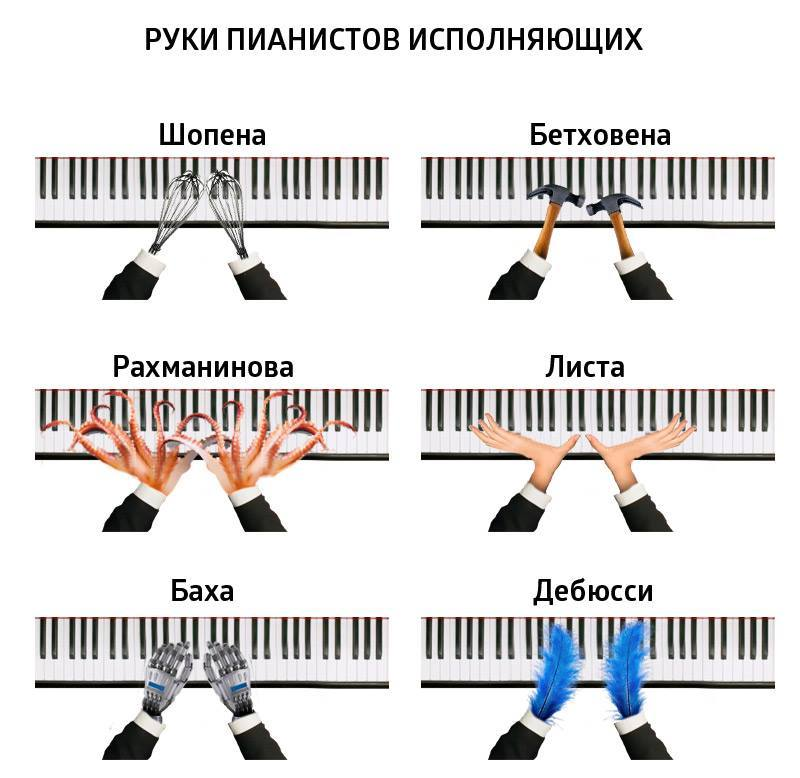

Задачи с Яндекс.Контент
===

Наверняка вы уже слышали об этом сервисе, но всё же, вот пару строк из описания: 

`Яндекс.Контест — это сервис для онлайн-проверки заданий по математике и программированию. Он предназначен для проведения состязаний любого уровня — от школьных олимпиад до соревнований международного класса. Его можно использовать также для подготовки к турнирам и приёма экзаменов.`

Вот я и решила попробовать свои силы на этом сервисе. 
А здесь, я буду собирать свои решения яндексовских задач на Node.js

##### Коротко обо мне:
- 2 высших музыкальных образования (магистратура): Фортепиано и Дирижирование академическим хором
- С лета 2017 в hardcore режиме изучаю JavaScript 

##### Из пианиста в программисты 

`Программисты и пианисты отличаются от остальных людей тем,
что больше думают руками, чем головой.`

;

