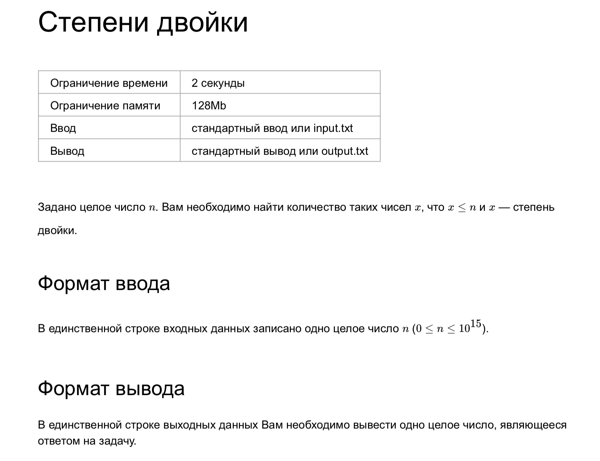

### Степени двойки

`Ограничение времени	2 секунды`
`Ограничение памяти	128Mb`
`Ввод	стандартный ввод или input.txt`
`Вывод	стандартный вывод или output.txt`

Задано целое число n. Вам необходимо найти количество таких чисел x, что x ≤ n и x — степень двойки.

#### Формат ввода

В единственной строке входных данных записано одно целое число n (0 ≤ n ≤ 1015).

#### Формат вывода

В единственной строке выходных данных Вам необходимо вывести одно целое число, являющееся ответом на задачу.

##### Пример 1

Ввод	Вывод
0
0

##### Пример 2

Ввод	Вывод
1
1

##### Пример 3

Ввод	Вывод
5
3
